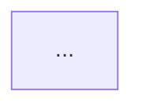

# PAH — Project Assistant Host

PAH is a local workspace for working with Python software projects, technical documentation, and research references from one interface.

## PAH 0.7.1 — visual identity

PAH 0.7.1 is a presentation-only visual identity integration. It keeps the 0.7 detachable-window and local-first behavior while replacing the generic dark-dashboard appearance with a shared PAH technical-software language: navy structural framing, sky/teal accents, light work/data surfaces, dark code and terminal regions, compact utility controls, and explicit section headers.

The host keeps its existing `pah.css` and loads the visual identity as reviewable override stylesheets. Analysis, Documents, References, and the nested Research Search tool each load the shared `pah-module-theme.css` contract after their legacy styles plus a small module-specific compatibility layer. No module IDs, routes, APIs, or JavaScript event contracts are renamed for the visual migration.


## PAH 0.7 — detachable workspaces

PAH 0.7 keeps the existing work modes docked in the main browser window while adding IDE-style detachment for **Analysis**, **Documents**, **References**, and the integrated **Terminal**.

- Open a full tool and choose **Detach** to move it into a separate resizable browser window.
- Detached module windows continue using PAH's existing loopback tool servers, so they remain bound to the same project/reference context.
- Each detached tool includes **Reattach**; closing its window also makes it available in the main PAH window again.
- While a tool is detached, clicking its PAH work-mode button focuses that window instead of creating a duplicate instance.
- The terminal keeps one PTY session: polling transfers to the detached terminal window and returns to the docked panel on reattach.
- Detachment is host-side only and does not modify or copy any Git submodule.


It combines a lightweight development workspace with three independently maintained tools:

* **CodeAnalyzer** — repository structure, dependencies, similarity, clustering, and duplication analysis
* **DocumentEngine** — Markdown, LaTeX, BibTeX, diagrams, and technical-document generation
* **ReferenceManager** — PDF libraries, BibTeX metadata, paper organization, and citation workflows

Each module remains independently runnable. PAH acts as the host that connects them and provides the workflows that cross module boundaries.

```text
                         PAH
                  Project Assistant Host
                           │
          ┌────────────────┼────────────────┐
          │                │                │
          ▼                ▼                ▼
    CodeAnalyzer     DocumentEngine   ReferenceManager
          │                │                │
          └────────────────┼────────────────┘
                           │
                     Project Workspace
```

## Why PAH?

Software projects often spread related work across several disconnected tools:

* source code lives in an editor or IDE;
* architecture and implementation analysis lives elsewhere;
* Markdown and LaTeX documentation use separate workflows;
* diagrams are manually maintained;
* research papers and BibTeX libraries live in another application.

PAH is designed to connect those artifacts without replacing the specialized tools that already handle them well.

The goal is a local project environment where code can be:

```text
edited
  ↓
analyzed
  ↓
referenced
  ↓
diagrammed
  ↓
documented
```

while research papers and technical references can participate in the same writing workflow.

---

## Work Modes

PAH provides four primary work modes:

```text
[ Workspace ] [ Analysis ] [ Documents ] [ References ]
```

### Workspace

The default PAH environment for everyday project work.

It includes:

* real local filesystem browsing;
* file and directory creation, rename, move, and delete;
* tabbed lightweight editing;
* local/offline syntax highlighting;
* undo/redo, search, indentation, and save;
* integrated PTY terminal;
* project `.venv` creation and selection;
* active Python-file execution;
* quick Code, Docs, and References context panels.

PAH metadata is stored outside the project under:

```text
~/.local/share/pah/
```

so opening a repository does not require adding PAH-specific files to it.

### Analysis

The full Code Repository Cataloguer interface is available directly inside PAH.

Analysis includes:

* Python AST/entity extraction;
* function, method, class, and module inspection;
* incoming and outgoing dependencies;
* pairwise similarity;
* global similarity matrices;
* duplicate-candidate analysis;
* clustering;
* dependency views;
* repository-level structural analysis.

Analysis is explicit rather than continuously tied to editing.

```text
Edit Python
    ↓
Save
    ↓
Analysis marked stale
    ↓
Re-analyze when needed
```

This keeps the editor lightweight while allowing deeper repository analysis on demand.

### Documents

The full Research Document Workbench is available as a dedicated writing environment.

It supports:

* Markdown;
* LaTeX;
* BibTeX;
* `.diagram` files;
* rendered document previews;
* Mermaid generation;
* diagram editing;
* LaTeX compilation;
* generated PDF viewing;
* technical-document workflows.

When hosted by PAH, the document workspace operates directly on the currently open project.

### References

The full Research Paper Repository Manager is available for literature-management work.

It supports:

* PDF libraries;
* BibTeX metadata;
* paper search and filtering;
* topics and statuses;
* notes;
* duplicate detection;
* local PDF access;
* citation workflows;
* library management.

The reference library can be completely separate from the currently open source-code repository.

---

## Quick Context vs. Full Tools

PAH provides two levels of interaction.

The right-side context panels are intended for quick project-time actions:

```text
selected Python function
        ↓
dependencies / similar code / documentation links

current document
        ↓
code / diagram / citation links

selected paper
        ↓
metadata / citation / usage
```

For deeper work, each panel can open its corresponding full workspace.

```text
Quick Code panel       → Full Analysis
Quick Docs panel       → Full Document Workbench
Quick References panel → Full Reference Manager
```

This allows PAH to remain lightweight during ordinary development without compressing complex analysis, writing, or research workflows into a small sidebar.

---

# Cross-Module Workflows

PAH owns the operations that connect the independent modules.

The modules themselves never import one another.

## Code → Document

Analyzed functions, methods, and classes can be inserted into Markdown or LaTeX documents as traceable references.

Example:

````markdown
<!-- PAH-CODE-REF
     id="..."
     path="src/model.py"
     entity="model.fit"
     mode="source"
     lines="40-76" -->

**`model.fit`** — `src/model.py, lines 40–76`

```python
def fit(...):
    ...
```

<!-- /PAH-CODE-REF -->
````

These blocks retain the analyzer entity identity, source path, and line information.

After source changes:

```text
Save Python
    ↓
Re-analyze
    ↓
Open document
    ↓
Refresh code references
```

PAH regenerates linked code blocks into the editor buffer while leaving surrounding writing untouched.

---

## Analyzer → Editable Diagram

PAH can convert analyzer dependency information into an editable `.diagram` source file.

```text
CodeAnalyzer
     ↓
entity + dependency relationships
     ↓
PAH bridge
     ↓
DocumentEngine validation
     ↓
editable .diagram
```

For example:

```text
calculate_similarity
        │
        ├──► build_descriptor
        ├──► cosine_similarity
        │
        ◄── build_similarity_matrix
```

can become:

```text
docs/diagrams/
    calculate_similarity_dependencies.diagram
```

The generated file remains ordinary editable source.

---

## Diagram → Document

A `.diagram` can be converted through DocumentEngine into Mermaid and inserted into Markdown.

````markdown
<!-- PAH-DIAGRAM-REF path="docs/diagrams/model_dependencies.diagram" -->



<!-- /PAH-DIAGRAM-REF -->
````

The marker retains the original diagram path so the rendered documentation remains connected to its editable source.

---

## Reference → Document

Papers managed by ReferenceManager can be inserted into writing workflows.

Markdown:

```markdown
[@smith2026]
```

LaTeX:

```latex
\cite{smith2026}
```

PAH can also import the current unsaved `.bib` editor buffer into the selected reference library.

---

## Documentation Scaffolds

PAH can generate deterministic Markdown documentation scaffolds from CodeAnalyzer output.

Three scopes are supported:

### Entity

Includes available information such as:

* qualified name;
* source location;
* signature;
* docstring;
* incoming dependencies;
* outgoing dependencies.

### File

Includes:

* file path;
* entities;
* signatures;
* source locations;
* sections for responsibilities, data flow, and maintenance notes.

### Project

Includes:

* repository structural counts;
* important code entities;
* architecture sections;
* similarity/duplication sections;
* development notes;
* reference sections.

These are intentionally **documentation scaffolds rather than generated behavioral claims**. Structural facts come from the analyzer, while purpose, design rationale, interpretation, and other higher-level writing remain visible areas for the author to complete.

---

# Artifact Traceability

PAH tracks explicit relationships between code, documents, diagrams, and references.

```text
Code entity ───── referenced by ─────► Documentation

Paper ─────────── cited by ──────────► Documentation

.diagram ──────── embedded in ───────► Markdown

Document ──────── contains ──────────► Code + Papers + Diagrams
```

This enables views such as:

```text
Used in Documents
```

for analyzed code entities and research papers.

Documents can also report the PAH code, diagram, and reference links they currently contain.

---

# Architecture

PAH is deliberately structured as a host rather than a monolithic application.

```text
Project_Assistant_Host/
│
├── pah/
│   ├── workspace/
│   ├── filesystem/
│   ├── editor/
│   ├── terminal/
│   ├── environments/
│   │
│   ├── integrations/
│   │   ├── analyzer.py
│   │   ├── documents.py
│   │   ├── references.py
│   │   ├── code_document.py
│   │   ├── analysis_diagram.py
│   │   ├── diagram_document.py
│   │   ├── documentation_scaffold.py
│   │   ├── artifact_links.py
│   │   └── reference_document.py
│   │
│   └── web/
│
└── modules/
    ├── code_analyzer/
    ├── tech_documents/
    └── reference_manager/
```

The primary dependency rule is:

```text
                 PAH
          ┌───────┼───────┐
          ▼       ▼       ▼
     Analyzer   Docs   References
```

and never:

```text
Analyzer ──► Documents
Documents ──► References
References ──► Analyzer
```

Cross-module functionality belongs to PAH.

---

## Module Responsibilities

```text
PAH
    workspace
    filesystem
    editor
    terminal
    Python environments
    tool coordination
    cross-module workflows

CodeAnalyzer
    Python AST analysis
    entities
    dependencies
    similarity
    clustering
    duplication analysis

DocumentEngine
    Markdown/document semantics
    diagrams
    Mermaid generation
    LaTeX compilation

ReferenceManager
    PDFs
    BibTeX
    paper metadata
    library operations
```

Each module remains independently installable and runnable outside PAH.

---

# Git Submodules

The three specialized tools are maintained as independent repositories and included in PAH as Git submodules.

```text
modules/
├── code_analyzer/
├── tech_documents/
└── reference_manager/
```

This allows each project to:

* remain independently runnable;
* maintain its own history and tests;
* be developed without loading the entire PAH codebase;
* expose only a small public API to the host;
* be pinned to a known-compatible revision by PAH.

A complete checkout can be obtained in one clone:

```bash
git clone --recurse-submodules <PAH_REPO_URL>
cd Project_Assistant_Host
./scripts/setup.sh
```

If the repository was cloned without submodules:

```bash
git submodule update --init --recursive
./scripts/setup.sh
```

---

# Installation

## Requirements

PAH currently targets local Python development environments.

Clone the complete project:

```bash
git clone --recurse-submodules <PAH_REPO_URL>
cd Project_Assistant_Host
```

Run setup:

```bash
./scripts/setup.sh
```

Activate the PAH environment:

```bash
source .venv/bin/activate
```

Start PAH:

```bash
python run.py
```

or immediately open a project:

```bash
python run.py /path/to/project
```

By default PAH runs locally at:

```text
http://127.0.0.1:8765
```

---

# Development

Run the PAH tests with:

```bash
pytest
```

Each module also maintains its own independent test suite.

Because the modules are installed as editable local packages during setup:

```bash
pip install -e modules/code_analyzer
pip install -e modules/tech_documents
pip install -e modules/reference_manager
```

changes made inside a submodule can be exercised immediately through PAH without copying code into the host.

---

# Project Status

PAH is currently an early-stage local project assistant focused on Python projects.

Current integrated capabilities include:

```text
✓ local project workspace
✓ lightweight editing
✓ integrated terminal
✓ Python virtual environments
✓ Python execution

✓ full code-analysis workspace
✓ dependency/similarity/clustering analysis

✓ full technical-document workspace
✓ Markdown / LaTeX / BibTeX
✓ diagrams and LaTeX builds

✓ full research-reference workspace
✓ PDF/BibTeX library management

✓ Code → Documentation
✓ Code → Diagram
✓ Diagram → Documentation
✓ Reference → Documentation
✓ artifact traceability
```

The project currently prioritizes local workflows and explicit deterministic analysis over IDE-style code intelligence or black-box automated documentation.

---

## Design Philosophy

PAH is not intended to replace a full IDE, Git client, reference manager, or publishing system.

Instead, it provides a common local environment around existing technical artifacts:

```text
Code
Papers
Documents
Diagrams
Terminal
```

and makes the relationships between them easier to inspect, maintain, and reuse.

The individual tools remain modular.

The project remains local.

The artifacts remain ordinary files.

PAH provides the layer connecting them.

