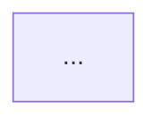

# PAH — Project Assistant Host

PAH is a local Python project workspace that coordinates independently runnable tools without absorbing their internal logic.

## PAH 0.5

PAH 0.5 is the first **cross-module workflow release**. The host still coordinates `CodeAnalyzer`, `DocumentEngine`, and `ReferenceManager` only through their public APIs, but it can now turn analysis/reference facts into traceable technical-documentation artifacts.

### Host features retained

- open any local project directory
- real filesystem tree and CRUD operations
- tabbed lightweight text/code editing
- local/offline syntax coloring
- save, undo/redo, find, indentation
- PTY-backed integrated terminal
- create/select a project `.venv`
- run the active Python file
- PAH metadata stored outside user projects under `~/.local/share/pah/`

### CodeAnalyzer integration retained

- explicit Analyze / Re-analyze action
- Python edits mark existing analysis stale instead of silently recomputing it
- active-file entities and source context
- incoming/outgoing dependencies
- similar-code and pairwise comparison
- global similarity summary
- duplicate-candidate analysis
- clustering summaries

### DocumentEngine integration retained

- Markdown, LaTeX, BibTeX, and `.diagram` discovery
- `.diagram` parsing/normalization and Mermaid generation
- isolated LaTeX compilation for arbitrary PAH workspaces
- compiler status for `latexmk` / Tectonic
- generated-PDF viewing through PAH

### ReferenceManager integration retained

- paper library may be independent from the open code workspace
- library selection stored in PAH state, not the project
- sync/search/filter/details through `ReferenceManager`
- local PDF opening
- working `Status` / `Notes` editing
- duplicate-group inspection
- import the current unsaved `.bib` editor buffer
- citation/note insertion into Markdown or LaTeX

## New 0.5 workflows

### 1. Analyzer → editable `.diagram`

Select an analyzed entity and choose **Dependency diagram**. PAH asks CodeAnalyzer for the entity and its incoming/outgoing relationships, converts those facts into the DocumentEngine `.diagram` format, validates the result through DocumentEngine, and creates a normal editable file in the project.

```text
CodeAnalyzer
    ↓
serialized entity + relationships
    ↓
PAH analysis_diagram bridge
    ↓
DocumentEngine validation
    ↓
docs/diagrams/..._dependencies.diagram
```

The generated file is ordinary source that can be manually edited, parsed, and normalized afterward.

### 2. `.diagram` → Markdown

Open a `.diagram` file, choose a Markdown target, and use **Insert diagram**. DocumentEngine generates Mermaid from the current in-memory diagram source; PAH inserts a bounded Mermaid block into the target document.

````markdown
<!-- PAH-DIAGRAM-REF path="docs/diagrams/model_dependencies.diagram" -->

<!-- /PAH-DIAGRAM-REF -->
````

The marker preserves the source `.diagram` path so the document remains traceable.

### 3. Refreshable code-reference blocks

New Code → Document insertions use bounded blocks containing the analyzer entity ID, path, qualified name, line range, and insertion mode.

````markdown
<!-- PAH-CODE-REF id="..." path="src/model.py" entity="model.fit" mode="source" lines="40-76" -->
**`model.fit`** — `src/model.py, lines 40–76`

```python
...
```
<!-- /PAH-CODE-REF -->
````

After code changes:

1. save the Python edits;
2. explicitly **Re-analyze**;
3. open the Markdown/LaTeX document;
4. choose **Refresh code refs**.

PAH resolves each stored analyzer entity and regenerates the bounded block into the **unsaved editor buffer**. Missing entities are reported and left untouched. Older unbounded PAH 0.3/0.4 markers remain readable and traceable but are not automatically rewritten because PAH cannot safely infer where their generated body ends.

### 4. Deterministic documentation scaffolds

PAH can generate Markdown scaffolds from analyzer facts at three scopes:

- **Entity docs** — location, signature, docstring, incoming/outgoing relationships, and writing sections.
- **File docs** — source path and an entity/signature/line table plus responsibility/flow/maintenance sections.
- **Project docs** — repository structural counts, key code entities, architecture/similarity/development/reference sections.

These are deliberately **scaffolds rather than AI-inferred prose**. Facts come from CodeAnalyzer; subjective behavioral/architectural explanation remains visibly marked for human completion.

### 5. Artifact traceability / “used in” views

PAH scans explicit markers in saved Markdown/LaTeX documents and exposes reverse links:

```text
Code entity  ── referenced by ──> docs/method.md
Paper        ── cited by ───────> paper/related_work.md
Document     ── contains ───────> code + paper + diagram links
```

The Code panel shows **Used in Documents** for the selected entity. The Refs panel shows **Used in Documents** for the selected paper. The Docs panel inspects the current unsaved Markdown/LaTeX buffer and lists its Code, Diagram, and Reference links.

Reverse “used in” results are based on saved files; the active document-link view uses the current unsaved editor buffer.

## Architecture

```text
PAH host
│
├── workspace / filesystem / editor / terminal / venv
│
├── integrations/
│   ├── analyzer.py                 → code_analyzer.CodeAnalyzer
│   ├── documents.py                → tech_documents.DocumentEngine
│   ├── references.py               → reference_manager.ReferenceManager
│   │
│   ├── code_document.py            → refreshable Code → Document blocks
│   ├── analysis_diagram.py         → Analyzer → .diagram
│   ├── diagram_document.py         → .diagram → Markdown
│   ├── documentation_scaffold.py   → analyzer-backed doc scaffolds
│   ├── artifact_links.py           → PAH marker traceability index
│   └── reference_document.py       → Reference → Document
│
└── modules/
    ├── code_analyzer/               Git submodule
    ├── tech_documents/              Git submodule
    └── reference_manager/           Git submodule
```

Major modules never import one another. Cross-module behavior belongs to PAH.

## Submodules

Each module remains independently installable and runnable. PAH's setup script installs initialized modules as editable local packages:

```bash
pip install -e modules/code_analyzer
pip install -e modules/tech_documents
pip install -e modules/reference_manager
```

Add them once with:

```bash
./scripts/add_submodules.sh \
  <CODE_ANALYZER_REPO_URL> \
  <TECH_DOCUMENTS_REPO_URL> \
  <REFERENCE_MANAGER_REPO_URL>
```

Then commit `.gitmodules` and the three module pointers.

A fresh checkout becomes:

```bash
git clone --recurse-submodules <PAH_REPO_URL>
cd Project_Assistant_Host
./scripts/setup.sh
```

## Run

```bash
./scripts/setup.sh
source .venv/bin/activate
python run.py /path/to/project
```

## Module boundaries

```text
PAH              → workspace/editor/filesystem/terminal/venv + coordination
CodeAnalyzer     → AST/entities/dependencies/similarity/clustering
DocumentEngine   → document semantics/diagrams/LaTeX builds
ReferenceManager → PDFs/BibTeX/paper metadata/library operations
```

The PAH panels intentionally expose common project/writing-time operations rather than replacing the three standalone applications. Full specialized administration remains available in each standalone project.

## Development

```bash
pytest
```

Core host tests work without optional modules. Integration and HTTP workflow tests activate automatically when the corresponding packages and Flask are installed.

See `ARCHITECTURE.md` for the dependency and traceability rules.
